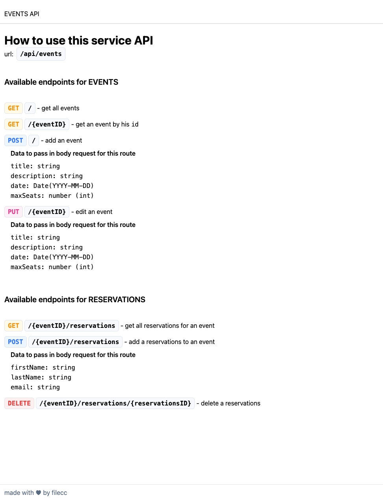

# Events API

This is a documentation for the Events API service.

## How to use this service API

The base URL for all endpoints is `/api/events`.
In order to use this API you need a valid API KEY to send over in Header for every request.

### Available endpoints for EVENTS

- **GET /**: Get all events.
- **GET /{eventID}**: Get an event by its `id`.
- **POST /**: Add an event. Data to pass in the body request for this route:
    - `title: string`
    - `description: string`
    - `date: Date(YYYY-MM-DD)`
    - `maxSeats: number (int)`
- **PUT /{eventID}**: Edit an event. Data to pass in the body request for this route:
    - `title: string`
    - `description: string`
    - `date: Date(YYYY-MM-DD)`
    - `maxSeats: number (int)`

### Available endpoints for RESERVATIONS

- **GET /{eventID}/reservations**: Get all reservations for an event.
- **POST /{eventID}/reservations**: Add a reservation to an event. Data to pass in the body request for this route:
    - `firstName: string`
    - `lastName: string`
    - `email: string`
- **DELETE /{eventID}/reservations/{reservationsID}**: Delete a reservation.

## Credits

This API documentation was made with ❤️ by [filecc](https://filecc.dev).

HOMEPAGE

